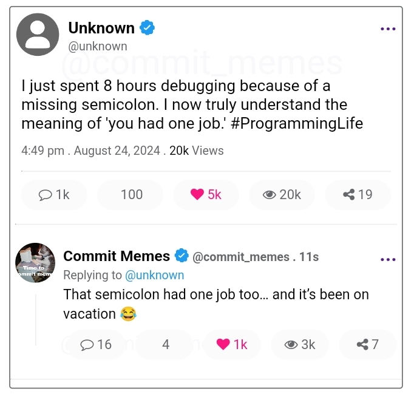

# MemeSite - Laravel Meme Management Platform

MemeSite is a simple Laravel-based platform designed for handling and managing memes from Twitter (X). The project allows users to manually copy and paste text from Twitter (X) into the platform's post page, where it is stored and managed using a MySQL database.

## Features

- **Simple Posting**: Easily copy and paste Twitter (X) posts into the platform to save them as memes.
- **MySQL Storage**: All memes are securely stored in a MySQL database for easy retrieval and management.
- **Post Management**: View, edit, and delete memes from a user-friendly interface.
- **User Authentication**: Secure login system to manage who can post and edit memes.

## Screenshots

### Index Page



*Description of what users see on the index page, including features like the list of memes and navigation options.*

### Post Page


*Description of the post creation form, highlighting the areas where users can paste Twitter (X) text and submit the meme.*

### Edit Page


*Description of the edit page, explaining how users can modify existing memes and save changes.*

### Post Comment Page                                                                                                                                     
*Description of the post creation form, highlighting the areas where users can paste Twitter (X) text and submit the meme.*                                                                             
### Edit Comment Page                                                                                                                                     
*Description of the edit page, explaining how users can modify existing memes and save changes.*

## Getting Started

### Prerequisites

Before you can run this project, ensure that you have the following installed:

- **PHP >= 8.0**
- **Composer** (Dependency Manager for PHP)
- **Laravel 10.x**
- **MySQL** (or another supported database)
- **Node.js & npm** (for managing frontend assets)

### Installation

1. **Clone the Repository**

   Clone the project repository to your local machine:

   ```bash
   git clone https://github.com/EliezerSunny/Meme_site.git
   cd Meme_site
   ```

2. **Install PHP Dependencies**

   Use Composer to install all the necessary PHP dependencies:

   ```bash
   composer install
   ```

3. **Install Node.js Dependencies**

   Install JavaScript dependencies for managing frontend assets:

   ```bash
   npm install
   ```

4. **Set Up Environment Variables**

   Copy the `.env.example` file to `.env` and configure your environment variables, especially the database settings:

   ```bash
   cp .env.example .env
   ```

   Update the `.env` file with your database credentials:

   ```env
   DB_DATABASE=meme
   DB_USERNAME=root
   DB_PASSWORD=sunny
   ```

5. **Generate Application Key**

   Generate the application key, which is used for encryption:

   ```bash
   php artisan key:generate
   ```

6. **Run Migrations**

   Run the following command to create the necessary database tables:

   ```bash
   php artisan migrate
   ```

7. **Start the Development Server**

   To start the Laravel development server, run:

   ```bash
   php artisan serve
   ```

   By default, the application will be accessible at `http://localhost:8000`.

## Usage

### Posting Memes

1. **Home page**: Access the home page to view the meme using `http://localhost:8000` which also have comment under post.
2. **Create a Post**: Navigate to the post creation page.
3. **Paste Twitter (X) Text**: Copy text from Twitter (X) and paste it into the post form.
4. **Save**: Submit the form to save the meme in the database.

### Posting Comment Memes Under Post
1. **Create a Comment under Post**: Navigate to the post comment creation page.
2. **Paste Twitter (X) Text**: Copy text from Twitter (X) and paste it into the post comment form.
3. **Save**: Submit the form to save the meme in the database.

### Managing Memes

- **Edit**: Modify existing memes via the edit page.
**Delete**: Remove unwanted memes from the database.

## Contact

For any questions or suggestions, feel free to reach out:

- **Twitter (X)**: [@eliezersunny](https://twitter.com/EliezerSunny)

